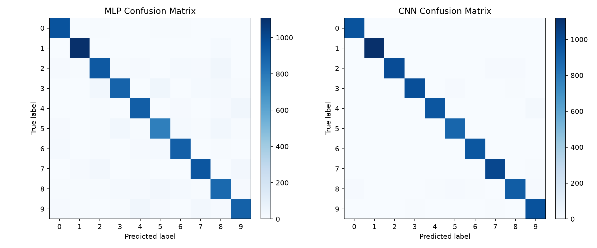
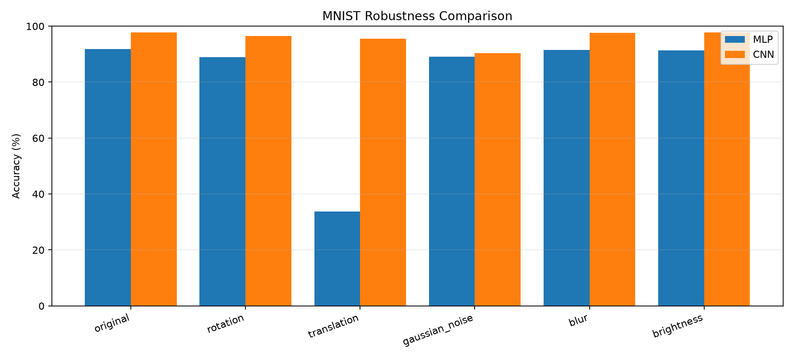
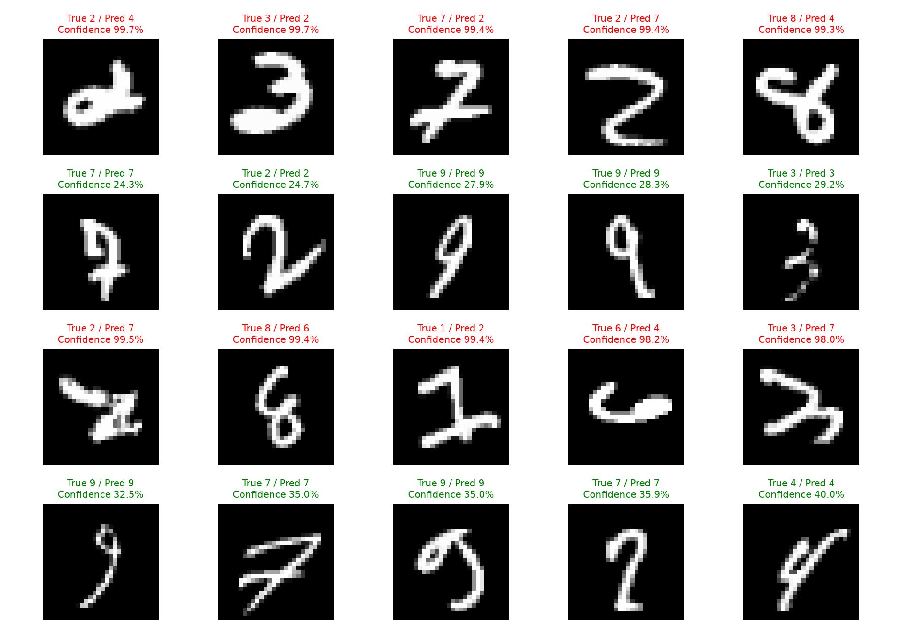

# MNIST 手写数字识别实验报告

> 最近一次实验日期：2026-09-01。本文只填写已经实际运行得到的结果；真实手写
> 图片测试尚未采集数据，因此对应章节不填写准确率。

## 1. 项目目标

本项目比较多层感知机（MLP）和卷积神经网络（CNN）在 MNIST 分类任务上的
性能、易混淆类别、常见图像变化下的鲁棒性和置信度失误。项目还提供真实照片
的两种预处理 A/B 测试，用于验证复杂预处理是否确实改善识别率。

## 2. 数据集介绍

MNIST 包含 60,000 张训练图片和 10,000 张测试图片。每张图片为 28×28 单通道
灰度图，标签为 0 至 9。所有分类指标和鲁棒性结果均在完整的 10,000 张官方
测试图片上计算。

## 3. MLP 和 CNN 模型结构

- MLP：`Flatten → Linear(784,128) → ReLU → Linear(128,64) → ReLU → Linear(64,10)`，
  共 109,386 个可训练参数。
- CNN：两组 `3×3 Conv → ReLU → 2×2 MaxPool`，通道数依次为 16 和 32，最后
  使用 `Linear(32×7×7,10)` 分类，共 20,490 个可训练参数。

没有加入更复杂的网络结构，以便把重点放在实验设计和错误分析上。

## 4. 实验设置

可复现对比实验使用相同的原始 MNIST 数据顺序、批大小 64、SGD、学习率
0.01 和 5 个 epoch，随机种子为 42、123、2026。该对比不使用随机数据增强，
使两种模型的输入保持一致。

| 模型 | 种子 | 参数量 | 训练时间（秒） | 测试准确率 | Macro F1 |
| --- | ---: | ---: | ---: | ---: | ---: |
| MLP | 42 | 109,386 | 4.12 | 91.39% | 91.25% |
| MLP | 123 | 109,386 | 4.18 | 91.38% | 91.21% |
| MLP | 2026 | 109,386 | 4.16 | 91.29% | 91.15% |
| CNN | 42 | 20,490 | 32.92 | 96.21% | 96.19% |
| CNN | 123 | 20,490 | 32.93 | 97.01% | 97.00% |
| CNN | 2026 | 20,490 | 37.45 | 96.70% | 96.67% |
| **MLP 平均** | — | 109,386 | — | **91.35%** | **91.20%** |
| **CNN 平均** | — | 20,490 | — | **96.64%** | **96.62%** |

三个种子下 CNN 均优于 MLP，平均准确率高 5.29 个百分点。训练计时只代表本次
运行环境，不应直接推广到其他硬件。

后续详细分类和鲁棒性分析使用项目中已有的保存权重。该 CNN 权重来自 10 个
epoch 且训练时含仿射增强，因此其 97.76% 结果不能与上表的受控 5-epoch 对比
混为同一次实验。

## 5. 分类结果

| 模型 | Accuracy | Macro Precision | Macro Recall | Macro F1 |
| --- | ---: | ---: | ---: | ---: | ---: |
| MLP | 91.81% | 91.71% | 91.70% | 91.69% |
| CNN | 97.76% | 97.74% | 97.77% | 97.75% |

MLP 每类命中率最低的是数字 5（86.21%），其次为 3（87.92%）和 8（88.81%）；
CNN 最低的是数字 8（95.07%），其次为 2（96.51%）和 9（96.53%）。这里的
“每类准确率”以该真实类别为分母，等同于该类别的 Recall。

混淆矩阵显示，MLP 最多的定向错误是 `3→5`（40 张）、`2→8`（36 张）和
`9→4`（36 张）；CNN 最多的是 `4→9`（18 张）、`2→8`（13 张）和
`2→7`（11 张）。CNN 不仅整体错误更少，在这些相似笔画类别上的混淆也明显
减少。



完整逐类数据见 `results/per_class_results.csv`。

## 6. 鲁棒性测试

每种变化使用固定参数：顺时针旋转 10°、向右下各平移 2 像素、高斯噪声标准差
0.20、3×3 高斯模糊（σ=1.0）和亮度缩放至 60%。噪声随机种子为 42。

| 测试条件 | MLP 准确率 | 相对原图下降 | CNN 准确率 | 相对原图下降 |
| --- | ---: | ---: | ---: | ---: |
| 原始 MNIST | 91.81% | — | 97.76% | — |
| 旋转 10° | 89.00% | 2.81 pp | 96.47% | 1.29 pp |
| 平移 (2,2) | 33.67% | 58.14 pp | 95.47% | 2.29 pp |
| 高斯噪声 | 89.14% | 2.67 pp | 90.39% | 7.37 pp |
| 高斯模糊 | 91.54% | 0.27 pp | 97.63% | 0.13 pp |
| 亮度 60% | 91.38% | 0.43 pp | 97.75% | 0.01 pp |

MLP 的最大弱点是平移，说明展平像素输入缺少平移适应能力。CNN 对平移更稳定，
但本次测试中高斯噪声造成的下降最大。轻度模糊和统一亮度缩放对两个模型影响
较小。



## 7. 真实手写图片测试

**尚未运行：当前 `real_images/` 中没有用户采集并标注的 20 至 50 张图片。**
因此不能判断增强预处理是否提高真实图片准确率，也不填写正确数、错误数或最
容易出错的数字。

采集后可按 `7_01.jpg` 或 `7/01.jpg` 标注，并运行：

```bash
python evaluate_real_images.py
```

脚本会让 MLP 和 CNN 分别接收两种输入：仅灰度缩放，以及背景检测、自动反色、
数字裁剪和重心对齐；逐图结果与汇总分别写入
`results/real_image_predictions.csv` 和 `results/real_image_results.csv`。

## 8. 错误样本与置信度分析

程序从完整测试集中分别选取置信度最高的 5 个错误预测和置信度最低的 5 个正确
预测。实际样本中，MLP 的高置信度错误达到 99.3% 至 99.7%，CNN 的高置信度
错误达到 98.0% 至 99.5%。部分字形确实接近另一个类别，例如写法变形的 2、3、
7 或 8；模型可能学到很强但错误的局部笔画证据。相反，一些细笔画、不完整或
非常规写法的数字虽然预测正确，置信度仍只有约 24% 至 40%。



**Softmax 输出只能表示模型自身的预测程度，并不保证预测一定正确。** 本实验
没有进行温度缩放等置信度校准，因此界面中的置信度不应解释为“预测正确的真实
概率”。

## 9. 项目局限性

- 真实手写照片测试集尚未采集，预处理流程的现实收益仍未得到验证。
- 鲁棒性测试每类只使用一个固定强度和方向，不能描述完整的性能退化曲线。
- 模型只在 MNIST 上训练，未覆盖复杂背景、阴影、透视畸变和多个数字。
- 三个随机种子可减少偶然性，但样本仍较少；训练时间也会受系统负载影响。
- 本实验只展示置信度反例，没有计算 ECE、可靠性图或执行校准。

## 10. 后续改进方向

1. 收集并冻结 20 至 50 张分布较均衡的真实图片，再运行预处理 A/B 测试。
2. 对旋转角度、平移距离和噪声强度设置多个等级，绘制退化曲线。
3. 根据真实图片错误决定是否调整阈值、裁剪和居中规则，避免在看到测试答案后
   反复调参造成数据泄漏。
4. 在不改变基础模型定位的前提下，补充可靠性图和 Expected Calibration Error。

## 结果文件

- `results/experiment_results.csv`：三个种子的受控训练结果。
- `results/classification_results.csv`：已有保存权重的整体分类指标。
- `results/per_class_results.csv`：逐数字 Precision、Recall、F1 和支持数。
- `results/robustness_results.csv`：每种图像变化下的准确率。
- `images/confusion_matrix.png`：双模型混淆矩阵。
- `images/error_samples.png`：置信度反例。
- `images/robustness_comparison.png`：鲁棒性柱状图。
